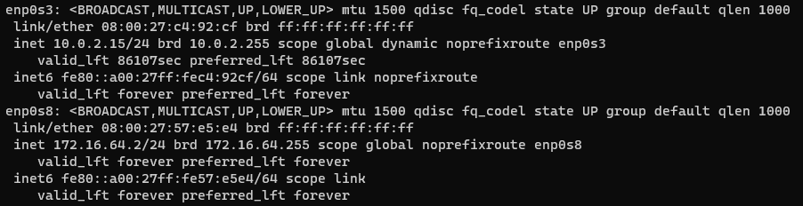
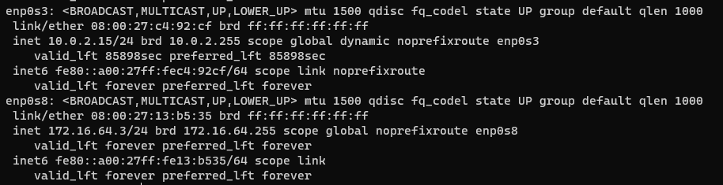

🎯 Quels sont les deux différents types d'hyperviseur existant, et quelles sont leur différence ?


L'hyperviseur de type 1, nommé « bare metal » s’exécute directement sur le matériel de l’hôte. 
L'hyperviseur de type 2, nommé « hébergé » s’exécute sous forme d’une couche logicielle sur un système d’exploitation, comme n’importe quel autre programme informatique. 

Donnez-leur des cartes réseau NAT, et ⏹️ associez-leur les adresses IP 172.16.64.2 et 172.16.64.3.




🎰 Changez le nom d'hôte des machines pour avoir respectivement vm-landing1 et vm-landing2

### vm-landing1
```
[gwuill@localhost ~]$ sudo hostnamectl set-hostname vm-landing1
[gwuill@localhost ~]$ reboot
[gwuill@vm-landing1 ~]$ coucou

```
### vm-landing2
```
[gwuill@localhost ~]$ sudo hostnamectl set-hostname vm-landing2
[gwuill@localhost ~]$ reboot
[gwuill@vm-landing2 ~]$ coucou

```

🎰 Trouvez l'adresse IP locale des machines

```
[gwuill@vm-landing1 ~]$ ip a
3: enp0s8: <BROADCAST,MULTICAST,UP,LOWER_UP> mtu 1500 qdisc fq_codel state UP group default qlen 1000
    link/ether 08:00:27:57:e5:e4 brd ff:ff:ff:ff:ff:ff
    inet 172.16.64.2/24 brd 172.16.64.255 scope global noprefixroute enp0s8
```

```
[gwuill@vm-landing2 ~]$ ip a
3: enp0s8: <BROADCAST,MULTICAST,UP,LOWER_UP> mtu 1500 qdisc fq_codel state UP group default qlen 1000
    link/ether 08:00:27:13:b5:35 brd ff:ff:ff:ff:ff:ff
    inet 172.16.64.3/24 brd 172.16.64.255 scope global noprefixroute enp0s8
```

🎯 Quelle est l'adresse de broadcast ?
L'adresse de broadcast est 172.16.64.255

🎰 Trouvez le masque de sous-réseau des machines & 🎰 Trouvez l'adresse MAC des machines

```
[gwuill@vm-landing1 ~]$ ip a
3: enp0s8: <BROADCAST,MULTICAST,UP,LOWER_UP> mtu 1500 qdisc fq_codel state UP group default qlen 1000
    link/ether 08:00:27:57:e5:e4 brd ff:ff:ff:ff:ff:ff
    inet 172.16.64.2/24 brd 172.16.64.255 scope global noprefixroute enp0s8
```

```
[gwuill@vm-landing2 ~]$ ip a
3: enp0s8: <BROADCAST,MULTICAST,UP,LOWER_UP> mtu 1500 qdisc fq_codel state UP group default qlen 1000
    link/ether 08:00:27:13:b5:35 brd ff:ff:ff:ff:ff:ff
    inet 172.16.64.3/24 brd 172.16.64.255 scope global noprefixroute enp0s8
```

🎰 Pingez l'adresse publique du site www.ynov.com avec une des deux machines

```
[gwuill@vm-landing2 ~]$ ping www.ynov.com
PING www.ynov.com (104.26.11.233) 56(84) bytes of data.
64 bytes from 104.26.11.233 (104.26.11.233): icmp_seq=1 ttl=56 time=19.0 ms
64 bytes from 104.26.11.233 (104.26.11.233): icmp_seq=2 ttl=56 time=21.9 ms
64 bytes from 104.26.11.233: icmp_seq=3 ttl=56 time=17.9 ms
```

🎰 Essayez de lire le contenu du fichier /var/log/syslog.
```
[gwuill@vm-landing1 ~]$ cat /var/log/syslog
cat: /var/log/syslog: No such file or directory
```

🎰 Essayez de lire le contenu du fichier /var/log/tallylog.

```
[labo-user1@vm-landing2 ~]$ cat /var/log/tallylog
cat: /var/log/tallylog: Permission denied
```

🎯 Vous remarquerez un problème. Pourquoi obtenez-vous cette erreur ?
On a pas les droits pour lire le fichier.

🎯 Il y aura toujours une erreur. Après avoir recherche sur Google la significance du groupe wheel dans Linux, pourquoi cette erreur est-elle toujours présente ?

Le groupe wheel permet d'exécuter des commandes dans des conditions restreintes. Le user ne peut donc pas lire le fichier.

🎯 Il n'y aura plus d'erreur. Pourquoi ?

Car le user n'est pas le sudoers et n'a donc pas les droits pour lire le fichier.


🎯 Ca devrait marcher. Pourquoi ?

Car le user qu'on utilise n'est pas dans le groupe wheel.


🎯 Ca devrait marcher. Pourquoi ?

Car on a autorisé le user a faire d'utiliser sudo.


🎰 Pingez vm-landing2 avec vm-landing1

```
[gwuill@vm-landing1 ~]$ ping 172.16.64.3
PING 172.16.64.3 (172.16.64.3) 56(84) bytes of data.
64 bytes from 172.16.64.3: icmp_seq=1 ttl=64 time=0.959 ms
64 bytes from 172.16.64.3: icmp_seq=2 ttl=64 time=0.655 ms
64 bytes from 172.16.64.3: icmp_seq=3 ttl=64 time=1.24 ms
64 bytes from 172.16.64.3: icmp_seq=4 ttl=64 time=0.663 ms
```

Sur la machine landing-vm1 :

Installez les paquets sl, dnsmasq et htop. 🎰 Vérifiez leur version

```
[gwuill@vm-landing1 ~]$ sudo systemctl status dnsmasq
Oct 18 11:00:34 vm-landing1 dnsmasq[1853]: started, version 2.85 cachesize 150
```
```
Installed:
  sl-5.02-1.el9.x86_64
```
```
[gwuill@vm-landing1 ~]$ htop -V
htop 3.2.2
```
Changez le DNS pour celui de CloudFlare puis 🎰 pingez google.com

```
[gwuill@vm-landing1 ~]$ ping 8.8.8.8
PING 8.8.8.8 (8.8.8.8) 56(84) bytes of data.
64 bytes from 8.8.8.8: icmp_seq=1 ttl=113 time=25.0 ms
64 bytes from 8.8.8.8: icmp_seq=2 ttl=113 time=21.9 ms
64 bytes from 8.8.8.8: icmp_seq=3 ttl=113 time=24.1 ms
^C
--- 8.8.8.8 ping statistics ---
3 packets transmitted, 3 received, 0% packet loss, time 2005ms
rtt min/avg/max/mdev = 21.923/23.665/24.967/1.281 ms
[gwuill@vm-landing1 ~]$ sudo cat /etc/resolv.conf
# Generated by NetworkManager
nameserver 10.33.10.2
nameserver 1.1.1.1

```

Sur la machine landing-vm2 :

Installez les paquets hotop, fail2ban et unzip. 🎰 Vérifiez leur version

```
[gwuill@vm-landing2 ~]$ htop -V
htop 3.2.2
```

```
[gwuill@vm-landing2 ~]$ unzip -V
UnZip 6.00 of 20 April 2009
```

```
[gwuill@vm-landing2 ~]$ fail2ban-client --version
Fail2Ban v1.0.2
```


Changez le DNS pour celui de Google puis 🎰 pingez cloudflare.com

```
[gwuill@vm-landing2 ~]$ sudo cat /etc/resolv.conf
# Generated by NetworkManager
nameserver 10.33.10.2
nameserver 8.8.8.8
[gwuill@vm-landing2 ~]$ ping 1.1.1.1
PING 1.1.1.1 (1.1.1.1) 56(84) bytes of data.
64 bytes from 1.1.1.1: icmp_seq=1 ttl=56 time=13.9 ms
64 bytes from 1.1.1.1: icmp_seq=2 ttl=56 time=14.8 ms
```


🎰 Trouvez et affichez la route par défaut présente sur la machine

```
[gwuill@vm-landing2 ~]$ ip route show
default via 10.0.2.2 dev enp0s3 proto dhcp src 10.0.2.15 metric 100
```

🎯 Quelle est l'utilité de ce type de carte réseau ?

Elles permettent de créer un réseau local entre les machines virtuelles.


🎰 Pingez landing-vm2 avec landing-vm1, que se passe-t-il ?

```
[gwuill@vm-landing2 ~]$ ping 172.16.64.2
PING 172.16.64.2 (172.16.64.2) 56(84) bytes of data.
64 bytes from 172.16.64.2: icmp_seq=1 ttl=64 time=0.776 ms
64 bytes from 172.16.64.2: icmp_seq=2 ttl=64 time=0.638 ms
64 bytes from 172.16.64.2: icmp_seq=3 ttl=64 time=1.04 ms
```